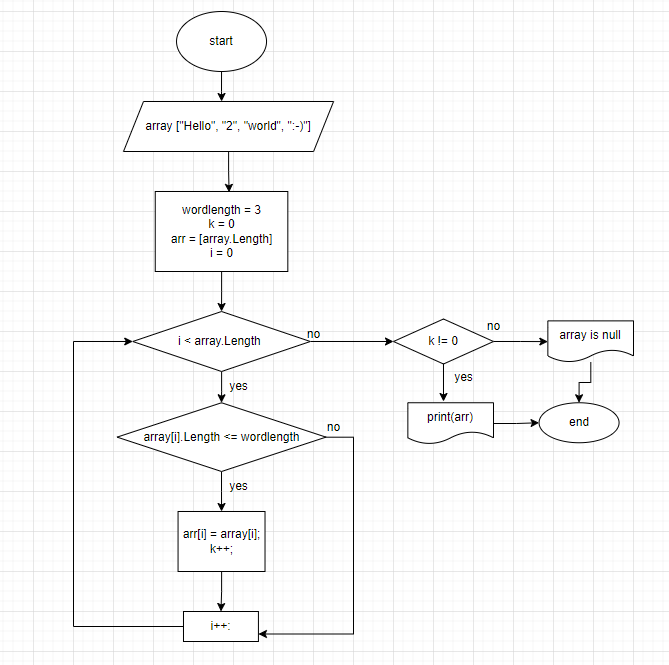

# Итоговый прект

## Задача пректа
Написать программу, которая из имеющегося массива строк формирует массив из строк, длина которых меньше, либо равна 3 символа. Первоначальный массив можно ввести с клавиатуры, либо задать на старте выполнения алгоритма. При решениии не рекомендуется пользоваться коллекциями, лучше обойтись исключительно массивами.

**Примеры:** 
- ["hello", "2", "world", ":-)"] -> ["2", ":-)"]
- ["1234", "1567", "-2", "computer science"] -> ["-2"]
- ["Russia", "Denmark", "Kazan"] -> []

## Блок-схема программы

**Описание блок-схемы**
1. На вход программы приходит массив сторок
2. Проверяем каждое значение из массива на условие: длина строки меньше или равна трем
3. Если строка удовлетворяет условию записываем это значение в новый массив
4. Повторяем пункты 2 и 3 до тех пор пока не достигнем конца исходного массива
5. Возвращаем новый заполненый массив по условию: если массив пустой выводим сообщение об этом, если нет, то выводим сам массив

## Код решения задачи
Код решения задачи можно посмотреть в папке code файл Program.cs.